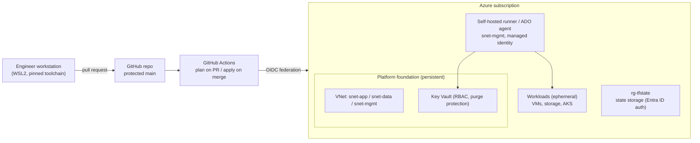

# Azure Platform Engineering — Regulated Pharma Reference Platform

A reference implementation of an enterprise Azure platform for a regulated (GxP/SOX-style)
pharmaceutical workload, designed and built to production standards: infrastructure as code,
pull-request change control, identity-based access and documented decisions.

> **Scope and framing.** The company in the scenario is fictional. This is a reference platform
> I designed and built to show how such a platform should be engineered; it is not a production
> system and contains no employer code, systems or data.

## 1. Scenario and requirements

A mid-size pharmaceutical company runs validated (GxP) and financially controlled (SOX)
applications on Azure. Its platform team must provide:

- **Traceable change** — every change is reviewed, recorded and reversible; no manual changes
  in the portal.
- **No standing secrets** — automation authenticates with federated identity; unavoidable
  secrets live in Key Vault.
- **Reproducibility** — any environment can be rebuilt from this repository alone.
- **Separation of environments** — dev and prod isolated by resource group, RBAC scope and tags.
- **Cost control** — persistent foundation at near-zero cost; workloads are ephemeral.

## 2. Target architecture

This is the target design; section 7 shows what is built today.

## 3. Repository layout

| Path | Purpose |
|---|---|
| `bootstrap/` | Idempotent scripts for what Terraform cannot create for itself (repository settings, state backend, CI identities) |
| `modules/` | Reusable Terraform modules, never applied directly, versioned by tag |
| `platform/` | Persistent root modules (foundation network, security) |
| `workloads/` | Ephemeral root modules (apply → verify → destroy) |
| `ansible/` | Configuration management: roles, inventories, playbooks |
| `pipelines/` | Azure DevOps multi-stage pipelines |
| `docs/adr/` | Architecture Decision Records |
| `docs/runbooks/` | Operational runbooks for every persistent component |
| `scripts/` | Local helper scripts |

## 4. Deploying from zero

1. Build the workstation: `docs/runbooks/workstation-setup.md`.
2. Clone the repository and run `pre-commit install` (hooks are per clone).
3. Apply repository settings: `bootstrap/github-repo-settings.sh`.
4. *(planned)* Create the state backend: `bootstrap/state-backend.sh`.
5. *(planned)* Create CI identities with OIDC federation: `bootstrap/github-oidc.sh`.
6. *(planned)* Apply `platform/foundation`, then `platform/security`, through pull requests.

## 5. Security model

- Identity first: OIDC for GitHub Actions, workload identity federation for Azure DevOps,
  managed identity for VMs, Entra ID auth for Terraform state (ADR-0002).
- `main` accepts changes only through pull requests; nobody can bypass the ruleset (ADR-0003).
- Pre-commit hooks on every commit: formatting, validation, tflint, yamllint and `gitleaks`
  secret scanning.
- Terraform state and plan files are treated as secrets and never committed.
- See [SECURITY.md](SECURITY.md).

## 6. Decisions

| ADR | Decision |
|---|---|
| [0001](docs/adr/0001-record-architecture-decisions.md) | Record architecture decisions |
| [0002](docs/adr/0002-secrets-and-identity.md) | Secrets and identity |
| [0003](docs/adr/0003-repository-governance.md) | Repository visibility and change control on `main` |
| [0004](docs/adr/0004-subscription-and-environment-layout.md) | Subscription and environment layout |
| [0005](docs/adr/0005-remote-state-backend.md) | Remote state backend |
| [0006](docs/adr/0006-storage-module-and-environment-roots.md) | Storage module and per-environment root modules |

## 7. Status

| Component | Status |
|---|---|
| Repository governance, quality gates, ADRs | ✅ in place |
| Terraform state backend | ✅ in place |
| Storage module (hardened baseline) with dev/prod roots | ✅ in place |
| Foundation network and Key Vault | ⬜ planned |
| CI/CD: GitHub Actions with OIDC | ⬜ planned |
| Configuration management (Ansible) and Azure DevOps pipelines | ⬜ planned |
| Containers (AKS), hub-spoke, private endpoints, Azure Policy | ⬜ planned |
